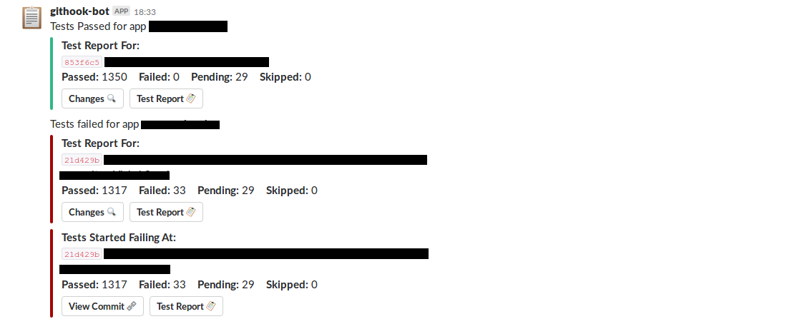

# PM2-CI

## Description

This is a PM2 module to do CI tasks like deploy, run tests, and send slack messages in response to a webhook.

##### It assumes that the tests are run through `mocha`, and `mochawesome` is added as a dev-dependency to the app.

## Install/Update

`pm2 install rohit-smpx/pm2-ci`

For now this is the way, until the app is published to npm.

## Flow of Module

<pre>
	Github/Manual Webhook (Set manual
	webhook by visiting `host:port`)
			|
			v
	Check if app is present in pm2 ls 
	and request is valid (via secret)
			|
			V
		Run tests (optional)			     __
			|					|
			V					|
		  Run git bisect 				|
		(only if tests fail) 			|- Tester Phase
			|					| (skip by setting
			V					| tests as false)
		Send Slack				     __|
		(test reports)
			|						  
			V				     __
		Pull application				|
			|					|
			V					|
		Run Prehook Command				|- Deploy Phase
			|					| (Not run if
			V					| tests fail and
		Restart Application				| deployAnyway is false)
			|					|
			V					|
		Run Posthook Command			     __|
</pre>

## Configure

```
{
	"apps": {},
	"slackWebhook": "",
	"slackChannel": "",
	"port": 8888,
	"host": "http://127.0.0.1/",
	"dataDir": "~/.pm2/pm2-ci"
}
```

### Apps
Contains configuration of applications you want managed by pm2-ci.

Each app is a JSON object like :

```
{
	"secret": "",
	"prehook": "npm install",
	"posthook": "",
	"cwd": "",
	"debug": false,
	"tests": {},
	"bisect": false,
	"slackChannel": "",
}
```
#### Secret
The github webhook secret.

#### Prehook
The command to execute before restarting the application. Use it to do tasks like, `npm install`, `gulp`, `webpack`, etc.

#### Posthook
The command to run after restarting the application.

#### CWD
The current working directory of the app, it will be automatically set from info from PM2 listing. But you can overwrite it here.

#### Debug
By default only `stderr` of the prehook, posthook, and testCmd will be output to the logs. To enable `stdout` output too, set debug to true.

### Apps - Tests

Set this as false if you want to skip tests and only use this module as something like an auto deploy system.

If using this, for now tests only run with mocha, and make sure to include mochawesome as a dev-dependency in your app.

If running tests make sure tests are not dependent on any external service running, or that anything needed by the them is setup using the single `testCmd`. (Of note maybe the DB, any Cache, external APIs).
Make sure the tests don't fail at random due to the app also running at the same time or another copy of the tests running at the same time.

```
{
	"testCmd": "",
	"githubToken": "",
	"privateConfig": "",
	"deployAnyway": false,
	"lastGoodCommit": "HASH",
}
```

#### Test Command (testCmd)
The command to execute to run tests, **should be an npm script calling [mocha](https://mochajs.org/)**. It should also include any pre requisite stuff, like `npm install`. So if your test command is `npm run test`, the testCmd will need to be set as `npm install && npm run test`;

**should exit with 0 for SUCCESS and any other for FAILURE**

#### Github Token
If your repo is private, please add an auth token to your profile and add it here. This is needed because the app makes a copy of your app in a temporary location to run tests.

#### Private Config
If your app is dependent on a private config to start, init properly and run tests. Specifiy the path to it relative to the app's cwd. It will be copied to the tests' temp directory before running tests.

#### Deploy Anyway
By default, if the tests fail the app is not pulled and restarted. But you can overwrite this behaviour with this option.


#### Last Good Commit

The Commit hash string of the know last good commit in the repo. This is used by `git bisect`. By default it is `HEAD~10` from the first time the a webhook is processed for the app.

**Set it as the last know commit where test report was being generated and tests were being passed**

### Slack
If running tests, the results of the test can be messaged by slack to any channel.



#### slackWebhook
The webhook url for slack.

#### slackChannel
The slack channel you want to send message to. Use @ for a person'd account, just the name for a channel.

### Other Settings

### Port
The port at which the server will listen for webhooks.

#### Host
This is host string that will be used to generate report urls for the slack message. This is basically the public ip/url of the server where this is hosted. 
So if this is behind a reverse proxy, use that address along with that port. 

**If no port is used here, the port is added according to the other setting.**

#### Data Directory
This is where pm2-ci will copy the test reports too and keep a db with all the test results.


## Example Config
```
{
	"apps": {
		"app_name": {
			"secret": "mysecret",
			"tests": {
				"testCmd": "npm run install && npm run test",
				"lastGoodCommit": "COMMIT_HASH",
				"privateConfig": "private/config.js"
				"githubToken": "",
				"deployAnyway": true
			},
			"prehook": "npm install --production && git submodule update --init",
			"posthook": "echo done",
		}
	},
	"host": "http://127.0.0.1",
	"slackWebhook": "https://hooks.slack.com/services/XXXXXXXXX/XXXXXXXXX/XXXXXXXXXXXXXXXXXXXXXXXX",
	"slackChannel": "",
	"dataDir": "~/.pm2/pm2-ci",
	"port": 8888
}
```

#### How to set these values ?

 After having installed the module you have to type :
`pm2 set pm2-ci:key value`

To set the `apps` option and since its a json string, it is adviced to escape it before to be sure that the string is correctly set ([using this kind of tool](http://bernhardhaeussner.de/odd/json-escape/)).

e.g: 
- `pm2 set pm2-ci:port 8080` (bind the http server port to 8080)
- `pm2 set pm2-ci:apps "{\"APP_NAME\":{\"secret\":\"supersecret\",\"prehook\":\"npm install --production && git submodule update --init\",\"posthook\":\"echo done\"}}"` 

##### Or use 

`pm2 conf`

Edit the file and save. And then reinstall module

## Uninstall

`pm2 uninstall pm2-ci`


## TODO:

- Use an internal queue to process requests
	- **Possible Problems:** If two pushes are done very close by and the tests of the first pass and second fail, we might stil pull the application to the second commit. As the calls are not done in a queue.
- Use vizion.revertTo instead of vizion.update in @pullTheApplication in [worker](./lib/Worker.js#L168)
	- **Possible Problems:** Might pull a commit newer than the last one that passed tests
	- Alternative: Use nodegit to pull the application directory
- Add better UI to fire off manual hooks, manual deploys.
- Add overlay over test report to add a back button
- Add basicAuth
- Use a single tmp directory for tests, instead of recloning everytime
- Wrap slack in notification class, add email as an option for notifications
- **Add Tests**
- Use existing ssh key to clone private repos
- Add branch filtering
- Add branch test running from pull request comments

## Contributing

Fork and submit a pull request.
To run just do `npm install` and `node index.js`.
To run through pm2, use `pm2 install .` in the directory you cloned the project.


## Credits

[@vmarchaud](https://github.com/vmarchaud) for the original [pm2-githook](https://github.com/vmarchaud/pm2-githook) module on which this is based. Though this is much different in scope now.
And to any other [contributors](https://github.com/vmarchaud/pm2-githook/graphs/contributors) of the module.

[Adam Gruber](https://github.com/adamgruber) for mochawesome/mochawesome-report-generator. The app listing and test listing templates are based on the mochawesome reports.
And to any other [contributors](https://github.com/adamgruber/mochawesome-report-generator/graphs/contributors) of the module.
